# Opengrapher

A Deno CLI for generating bespoke Open Graph PNGs from TSX templates.

Opengrapher renders `1200x630` project cards with `takumi-js`. It supports
runtime font fetching, config files, graph-paper and SVG blob backgrounds, and
terminal/window frame presets.

## Usage

```sh
deno task og \
  --title "Opengrapher" \
  --description "Bespoke Open Graph images from TSX templates." \
  --font-preset IBM \
  --background graph-paper-light \
  --out dist/og.png
```

Render from a config file:

```sh
deno task og --config examples/marker.toml
```

Render a terminal card:

```sh
deno task og \
  --template terminal \
  --terminal mac \
  --title "Mac Terminal" \
  --description "Reusable window chrome for OG images." \
  --out dist/mac.png
```

## Config files

TOML and JSON configs are supported. CLI flags override config values.

```toml
title = "Read with intention."
description = "A mobile browser for reading and thinking."
eyebrow = "github.com/stormlightlabs/marker"
site = "marker.stormlightlabs.org"
out = "dist/marker.png"

template = "card"
fontPreset = "Vercel"
background = "graph-paper-light"
terminal = "mac"

[theme]
accent = "#2d6cdf"
surface = "#f6f5f0"
ink = "#111111"
muted = "#77736b"
highlight = "#ffd85a"
```

See `examples/` for reference configs. Blob configs live in `examples/blobs/`.

## Rendered text fields

Most visible text can be set in config files or with CLI flags:

| Rendered text                 | Config key    | CLI flag        |
| ----------------------------- | ------------- | --------------- |
| Main headline                 | `title`       | `--title`       |
| Supporting copy               | `description` | `--description` |
| Small top label               | `eyebrow`     | `--eyebrow`     |
| Site label / window title     | `site`        | `--site`        |
| Repository/footer label       | `repo`        | `--repo`        |
| Path / terminal command label | `path`        | `--path`        |

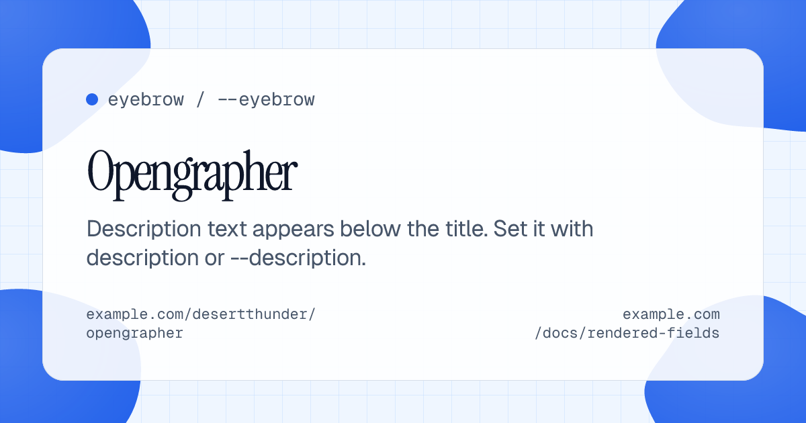

## Font presets

- `IBM`: IBM Plex Serif, IBM Plex Sans, IBM Plex Mono
- `Vercel`: Instrument Serif, Geist Sans, Geist Mono
- `Monaspace`: Monaspace Radon, Monaspace Neon, Monaspace Argon

Font files are fetched at runtime and cached in `.cache/opengrapher/fonts`.
Fontsource presets use pinned package versions. Monaspace uses the pinned GitHub
release asset `githubnext/monaspace@v1.101`.

| IBM                                                                                  | Vercel                                                                                     | Monaspace                                                                                        |
| ------------------------------------------------------------------------------------ | ------------------------------------------------------------------------------------------ | ------------------------------------------------------------------------------------------------ |
| 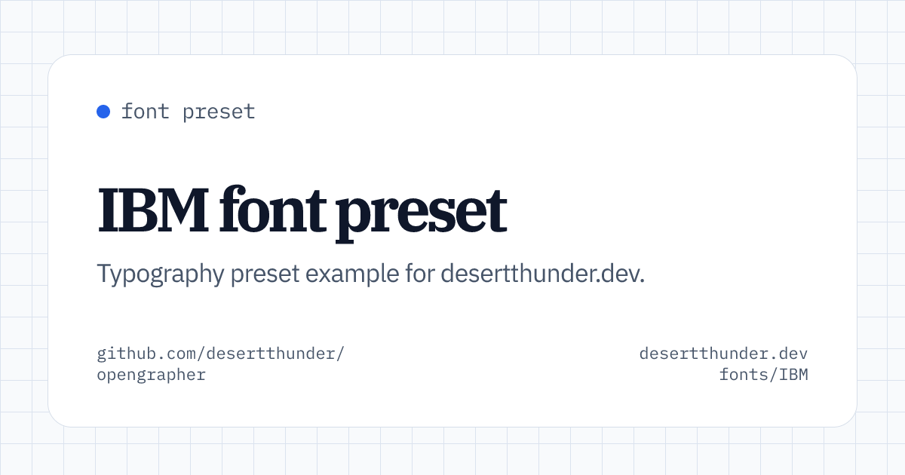 | 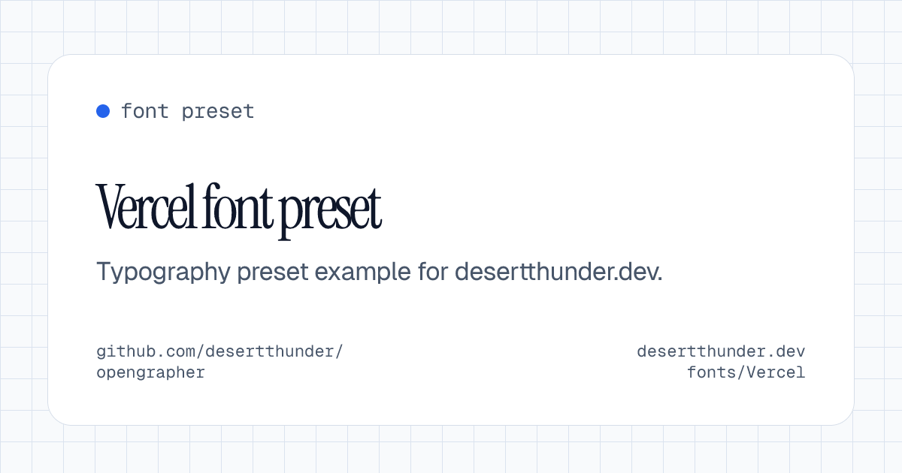 | 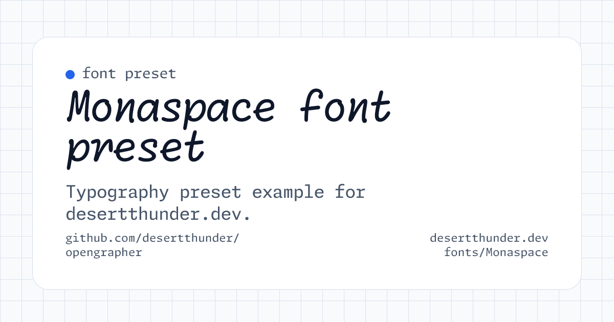 |

## Background presets

- `graph-paper-light`
- `graph-paper-dark`
- `graph-paper-indigo`
- `graph-paper-warm`
- `blobs-soft`
- `blobs-gooey`
- `blobs-editorial`
- `blobs-solid`
- `blobs-duotone`

Blob presets are rendered as deterministic SVG overlays. Presets include
multi-color, 100% opacity solid-color, and 100% opacity duotone-gradient
variants. The gooey variant uses SVG filter primitives instead of CSS filters
for more reliable Takumi output.

## Graph paper examples

| Light                                                                                           | Dark                                                                                          |
| ----------------------------------------------------------------------------------------------- | --------------------------------------------------------------------------------------------- |
| 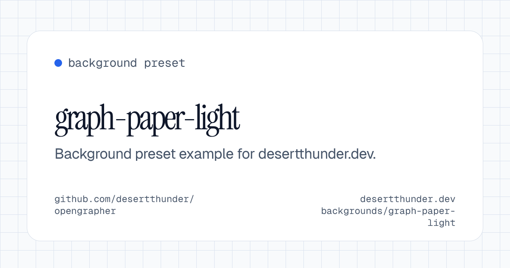 | 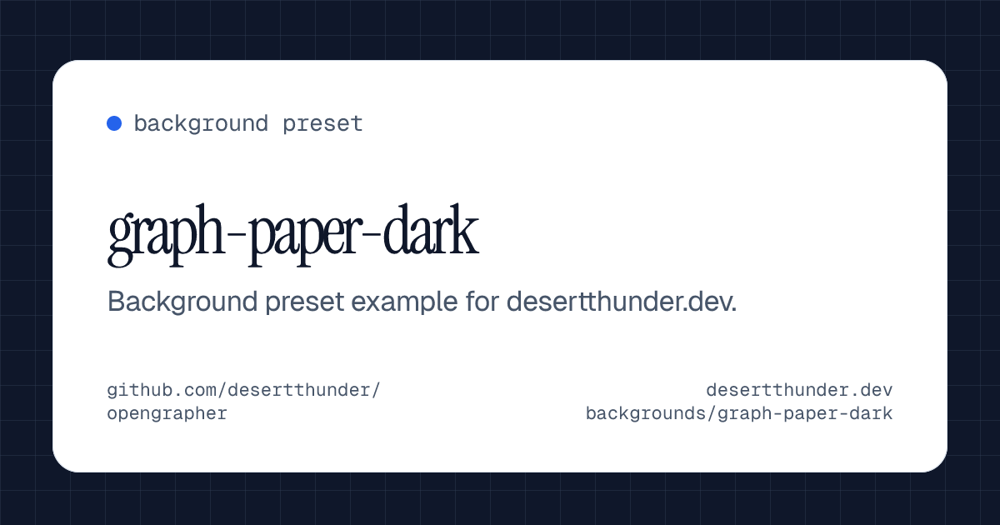 |

| Indigo                                                                                            | Warm                                                                                          |
| ------------------------------------------------------------------------------------------------- | --------------------------------------------------------------------------------------------- |
| 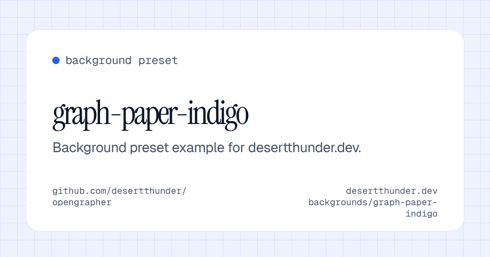 | 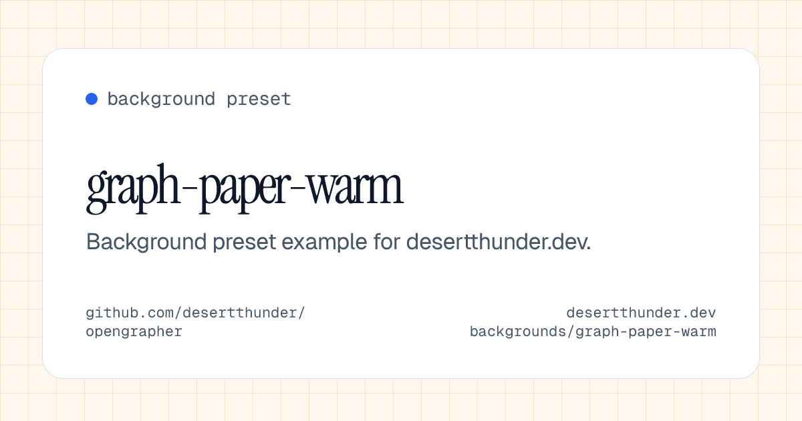 |

## Blob examples

| Soft                                                                             | Gooey                                                                                |
| -------------------------------------------------------------------------------- | ------------------------------------------------------------------------------------ |
| 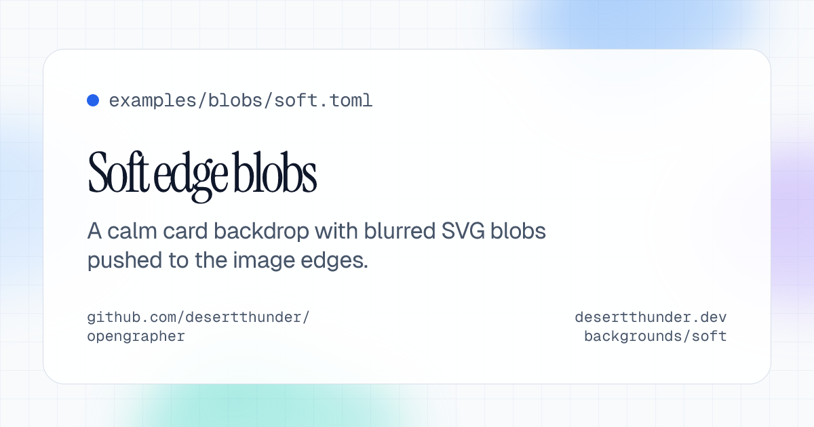 | 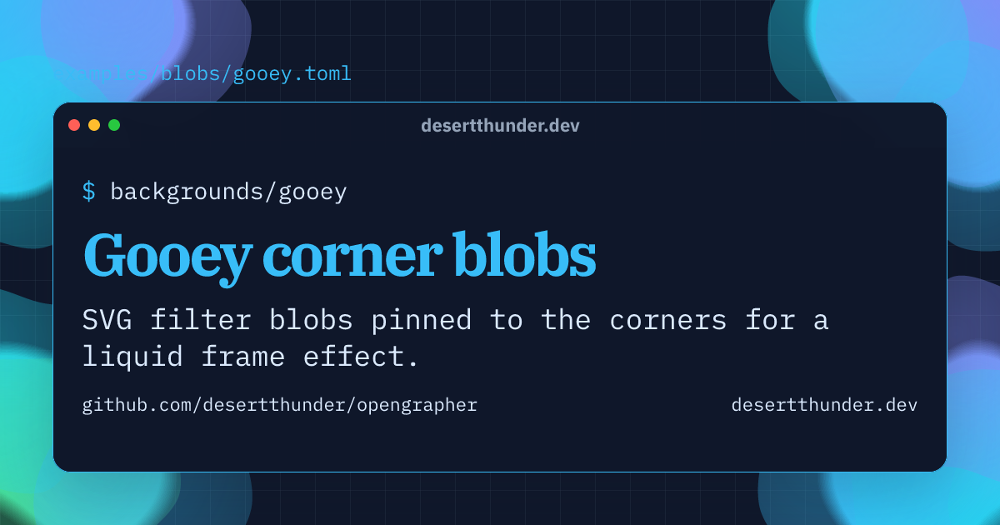 |

| Editorial                                                                             | Solid                                                                               | Duotone                                                                             |
| ------------------------------------------------------------------------------------- | ----------------------------------------------------------------------------------- | ----------------------------------------------------------------------------------- |
| 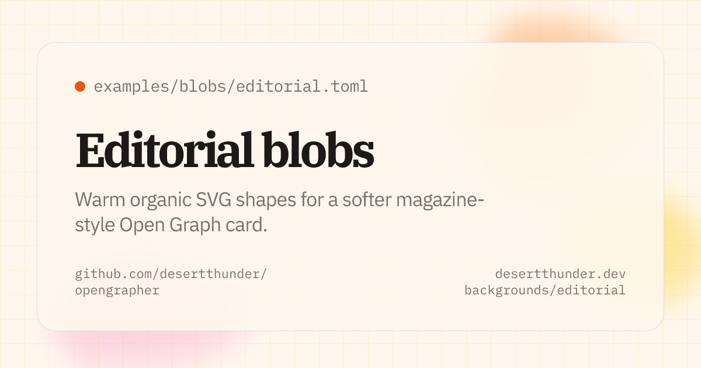 | 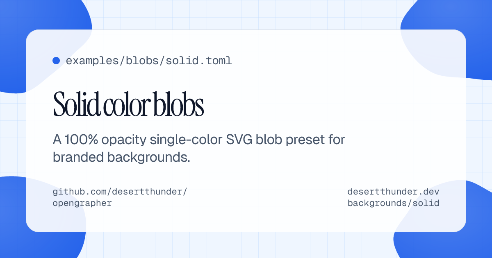 | 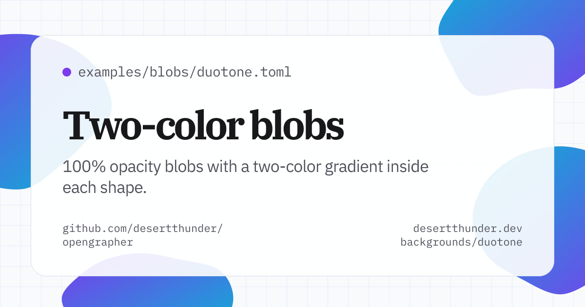 |

## Terminal styles

Use these with `--template terminal --terminal <name>`:

- `mac`: stoplight controls
- `windows`: title bar with window controls
- `gnome`: simple header bar with a single icon
- `win95`: pixel-style bevels and classic blue chrome

The `windows` and `win95` controls use vendored Fluent UI minimize,
maximize, and close icons. The `gnome` close button uses the same vendored
close icon.

| Mac                                                                                         | Windows                                                                                             |
| ------------------------------------------------------------------------------------------- | --------------------------------------------------------------------------------------------------- |
| 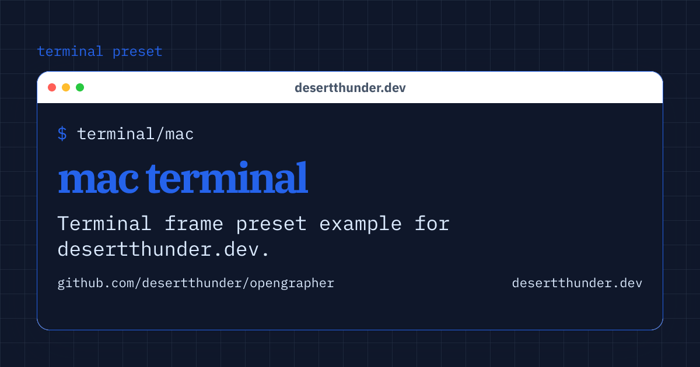 | 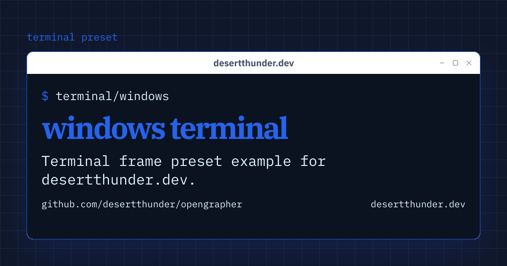 |

| GNOME                                                                                           | Win95                                                                                           |
| ----------------------------------------------------------------------------------------------- | ----------------------------------------------------------------------------------------------- |
| 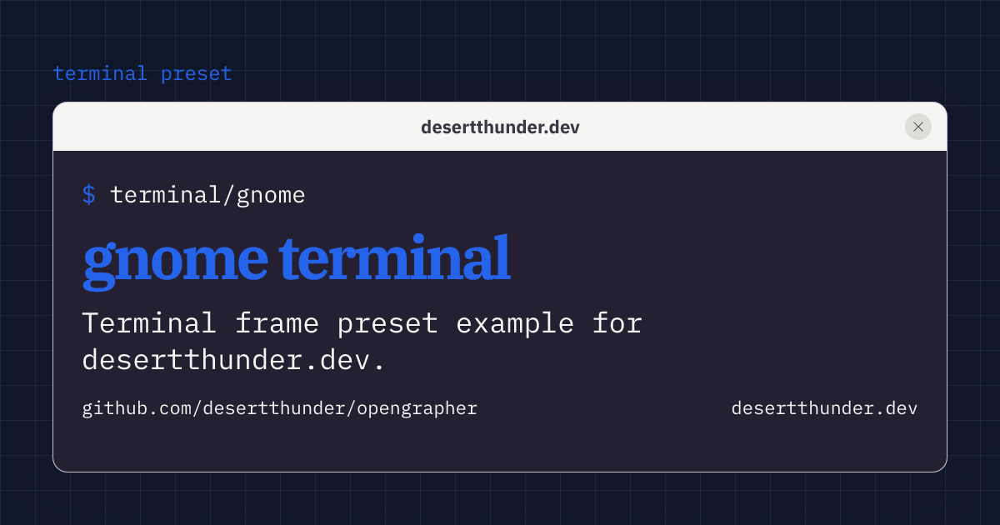 | 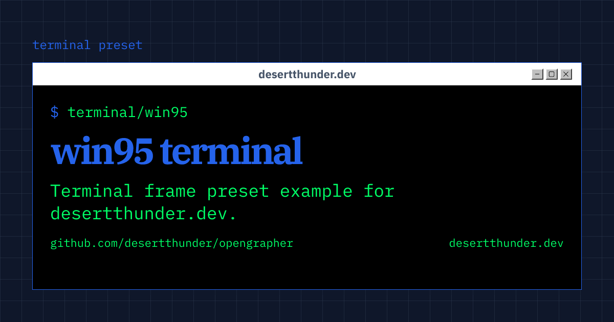 |

## CLI options

- `--config <path>`: TOML or JSON config file
- `--title <text>`: image title
- `--description <text>`: image description
- `--eyebrow <text>`: small label above the title
- `--site <text>`: site URL or label
- `--repo <text>`: repository label
- `--path <text>`: path label
- `--out, -o <path>`: output path, defaults to `dist/og.png`
- `--format <png>`: output format, currently only `png`
- `--width <number>`: width, defaults to `1200`
- `--height <number>`: height, defaults to `630`
- `--font-preset <name>`: `IBM`, `Vercel`, or `Monaspace`
- `--background <name>`: background preset
- `--template <name>`: `card` or `terminal`
- `--terminal <name>`: `mac`, `windows`, `gnome`, or `win95`
- `--help, -h`: show help

## License

[MIT](./LICENSE)
